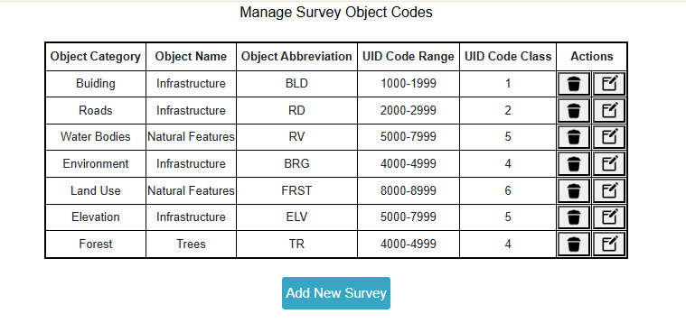
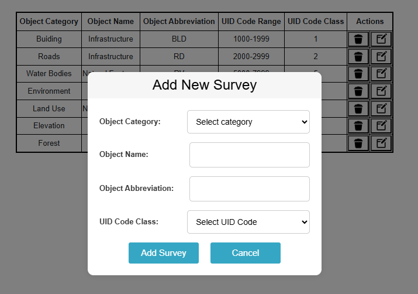
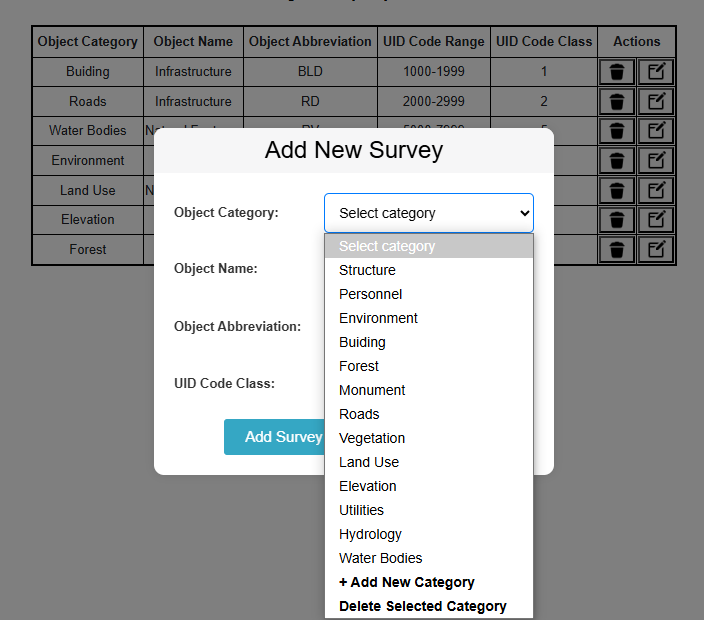

# ✈️ Airport Authority of India – Manage Survey Code Object
This project is a part of the Airport Authority of India system to manage survey code entries. It includes a SvelteKit frontend, a Node.js + Express backend, and PostgreSQL as the database.

# 📌 Features
View all survey code entries in a tabular format.

1.Add new survey code objects.

2.Edit existing survey codes.

3.Delete survey entries (with nested UID support).

4.Dynamic Select Category option linked to a secondary table.

5.Complete CRUD operations from frontend to backend.

# 🛠 Tech Stack
| Layer      | Technology             |
| ---------- | ---------------------- |
| Frontend   | SvelteKit (JavaScript) |
| Backend    | Node.js, Express.js    |
| Database   | PostgreSQL             |
| Versioning | Git, GitHub            |

#📸 Screenshot

🧩 Database Schema Overview
manage_survey_code – Main table storing survey codes.

select_category – Reference table used in dropdowns.

uid_code –Reference table in dropdowns.

🙋‍♀️ Author
👩‍💻 Deepika Jaiswal
📧 Email: [deepikajaiswal305@gmail.com]
